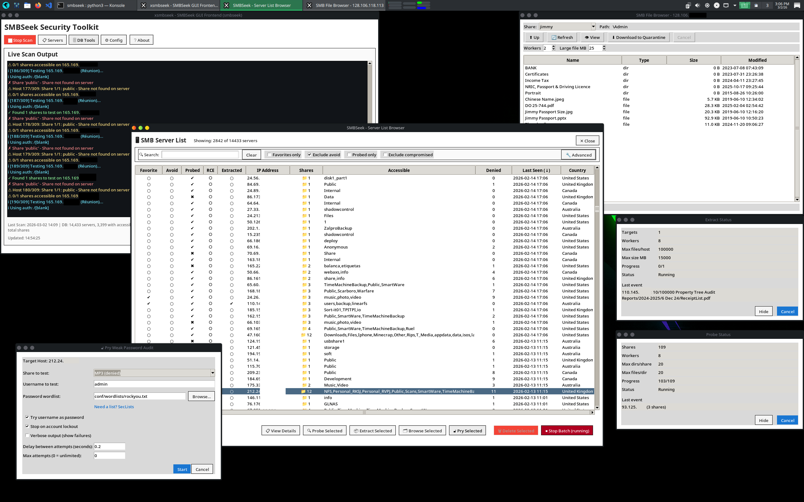
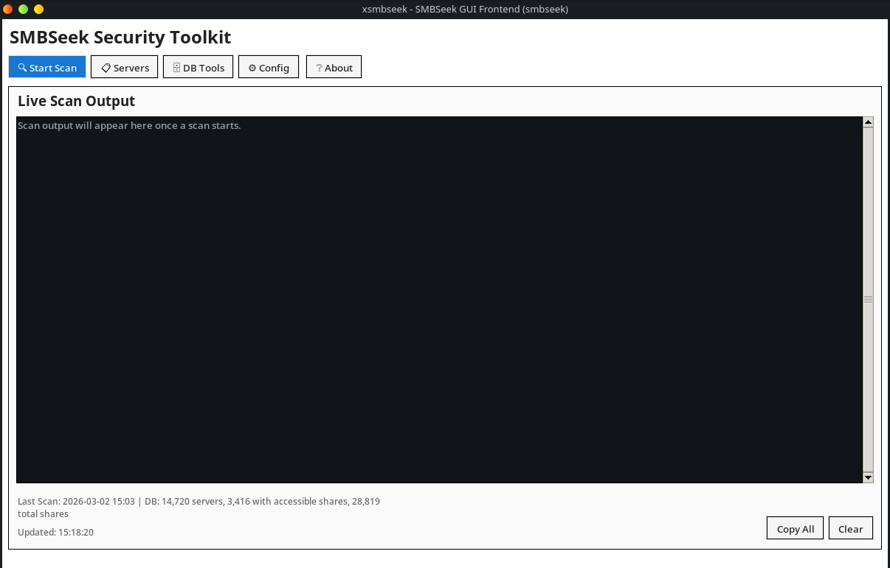
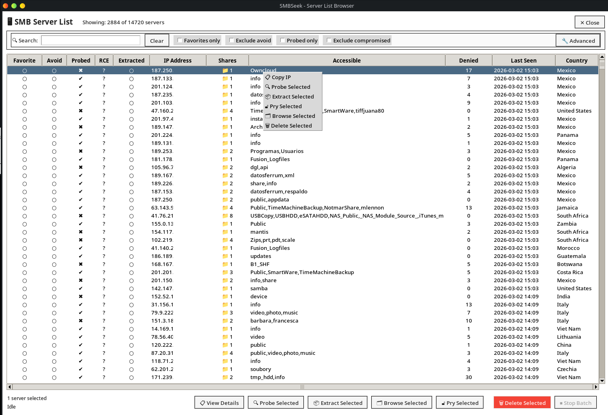
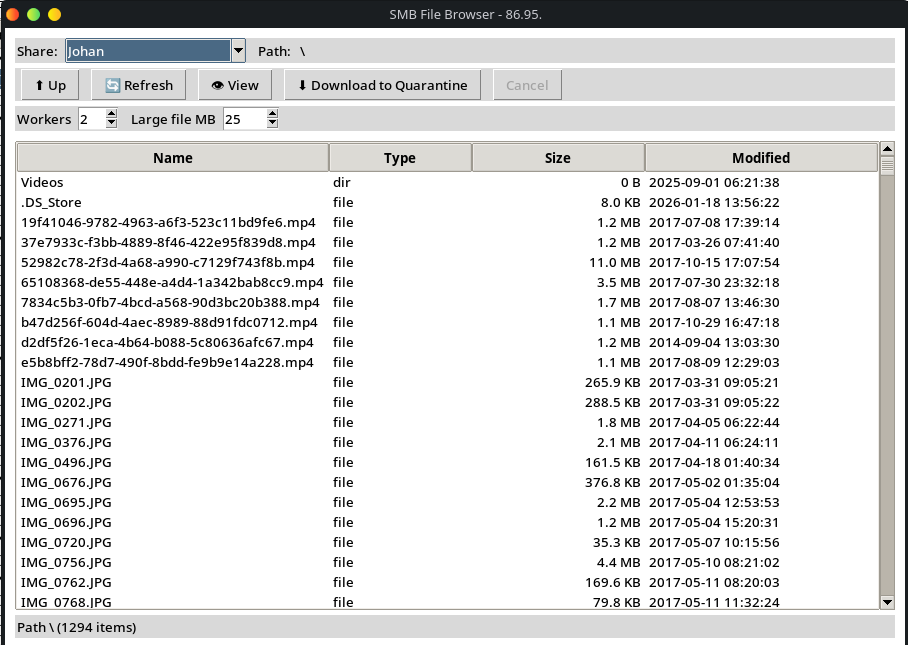
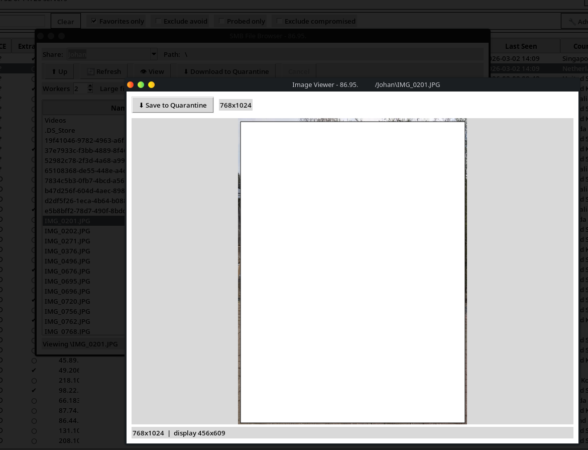
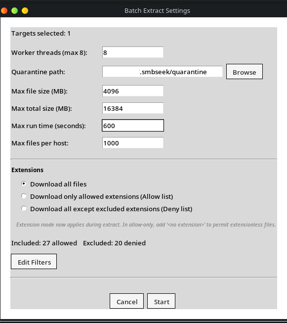

# SMBSeek

A GUI for finding SMB servers with weak or no authentication, then auditing what's exposed.

---



## Setup

You'll need Python 3.8+ (3.10+ recommended), Tkinter, and smbclient:

```bash
# Ubuntu/Debian
sudo apt install python3-tk smbclient python3-venv

# Fedora/RHEL
sudo dnf install python3-tkinter samba-client python3-virtualenv

# Arch
sudo pacman -S tk smbclient python-virtualenv
```

Then:

```bash
git clone https://github.com/b3p3k0/smbseek
cd smbseek
python3 -m venv venv
source venv/bin/activate
pip install -r requirements.txt
cp conf/config.json.example conf/config.json
```

Edit `conf/config.json` and add your Shodan API key (requires paid membership):

```json
{
  "shodan": {
    "api_key": "your_key_here"
  }
}
```

Launch the GUI from your venv:

```bash
./xsmbseek
```

---

## Using xSMBSeek

### Dashboard



The main window. From here you can:
- Launch discovery scans (filtered by country or global)
- Open the Server List to work with hosts you've found
- Manage your database (import, export, merge, maintenance)
- Edit configuration

### Server List


 Shows discovered SMB hosts with IP, country, auth method, and share counts as well as status indicators and a favorite/avoid list.

**Operations** (right-click a host or bottom row buttons):
- **Probe** — enumerate shares, detect ransomware indicators
- **Browse** — read-only exploration of accessible shares
- **Extract** — collect files with hard limits on count, size, and time
- **Pry** — password audit against a specific user

### Probing Shares

Read-only directory enumeration that previews accessible shares without downloading files. Probing collects root files, subdirectories, and file listings for each accessible share (with configurable limits on depth and breadth).

**Ransomware detection:** Filenames are matched against 25+ known ransom-note patterns (WannaCry, Hive, STOP/Djvu, etc.). Matches flag the server with a red indicator in the list view.

**RCE vulnerability analysis:** Optionally scans for SMB vulnerabilities using passive heuristics. Covers 8 CVEs including EternalBlue (MS17-010), SMBGhost (CVE-2020-0796), ZeroLogon (CVE-2020-1472), and PrintNightmare (CVE-2021-34527). Returns a risk score (0-100) with verdicts: confirmed, likely, or not vulnerable. Signatures live in `signatures/rce_smb/` as editable YAML files. **NOTE: this feature is still under development; don't trust results until verified with alternative measures.**

Results are cached in `~/.smbseek/probes/` and reloaded automatically. Configure probe limits in `conf/config.json` under `file_browser` settings.

### Browsing Shares


Read-only navigation through SMB shares. Double-click directories to descend, files to preview. You can also select a file and click **View**.

The viewer auto-detects file types: text files display with an encoding selector (UTF-8, Latin-1, etc.), binary files switch to hex mode, and images (PNG, JPEG, GIF, WebP, BMP, TIFF) render with fit-to-window scaling.



Files over the specified maximum (default: 5 MB) trigger a warning—you can bump that limit in `conf/config.json` under `file_browser.viewer.max_view_size_mb`, or click "Ignore Once" to load anyway (hard cap: 1 GB).

Downloads land in quarantine (`~/.smbseek/quarantine/`). The browser never writes to remote systems.

### Extracting Files


Automated file collection with configurable limits:
- Max files per target
- Max total size
- Max runtime
- Max directory depth

All extracted files land in quarantine. The defaults are conservative — check `conf/config.json` if you need to adjust them.

### Pry (Password Audit)

Tests passwords from a wordlist against a single host/share/user. Optionally tries username-as-password first.

To use it, download a wordlist (we recommend [SecLists](https://github.com/danielmiessler/SecLists)) and set the path in config:

```json
{
  "pry": {
    "wordlist_path": "/path/to/SecLists/Passwords/Leaked-Databases/rockyou.txt"
  }
}
```

Pry includes lockout detection and configurable delays between attempts. That said, **this feature exists mostly as a novelty/proof of concept** — dedicated tools like Hydra or CrackMapExec will serve you better for serious password auditing.

---

## Configuration

App settings are stored in `conf/config.json`. The example file (`conf/config.json.example`) documents every option.

Key sections:
- `shodan.api_key` — required for discovery
- `pry.*` — wordlist path, delays, lockout behavior
- `file_collection.*` — extraction limits
- `file_browser.*` — browse mode limits
- `connection.*` — timeouts and rate limiting

Two additional files hold editable lists:

- `conf/exclusion_list.json` — Organizations to skip during Shodan queries (hosting providers, ISPs you don't care about etc.). Add entries to the `organizations` array.
- `conf/ransomware_indicators.json` — Filename patterns checked during probe. Matches flag a server as likely compromised.

These are separate so you can customize or share them without touching app settings.

The GUI includes a built-in config editor for common settings.


## Advanced

### Templates

**Scan templates** save your search configuration — country filters, Shodan limits, concurrency, rate limits. Click "Save Current" in the scan dialog. Templates live in `~/.smbseek/templates/` as JSON files you can edit directly.

**Filter templates** save your server list filters — search text, date range, countries, checkboxes. Click "Save Filters" in the advanced filter panel. Stored in `~/.smbseek/filter_templates/`.

Both auto-restore your last-used template on startup.

### CLI Usage

The CLI is useful for scripting and automation. The GUI uses the same backend.

```bash
./smbseek --country US              # Discover US servers
./smbseek --country US,GB,CA        # Multiple countries
./smbseek --string "SIPR files"     # Search by keyword
./smbseek --verbose                 # Detailed output
```

Results persist to `smbseek.db` (SQLite). For full CLI documentation, see [docs/guides/USER_GUIDE.md](docs/guides/USER_GUIDE.md).

---

## Development

Built through AI-human collaboration. The human directing this project has hands-on experience in networking and security—this isn't autonomous code generation, it's directed development with human oversight, testing, and domain expertise driving the AI's output.

---

## Legal & Ethics

Scan networks you own or have explicit permission to test. Unauthorized access is illegal in most jurisdictions—full stop.

That said: security research matters. Curiosity about how systems work isn't malicious, and understanding vulnerabilities is how we fix them. This tool exists because open SMB shares are a real problem worth studying. Use it to learn, to audit, to improve defenses and responsibly disclose. Don't use it to steal data or harm systems you have no business touching.

If you're unsure whether something is authorized, it probably isn't. When in doubt, get it in writing.

---

## Acknowledgements

**Pry password logic** derived from [mmcbrute](https://github.com/giMini/mmcbrute) (BSD-3-Clause)

**Wordlists** from [SecLists](https://github.com/danielmiessler/SecLists) (MIT)

Licensed under MIT. See `LICENSE` and `licenses/` for details.
